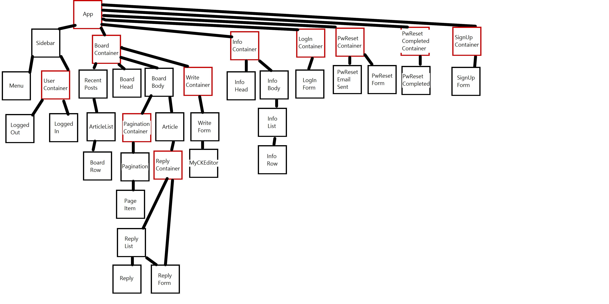

# Board Practice

## 프로젝트 목적

1. react, redux에 대한 기본적인 이해를 하고 사용법을 숙달하고자 했습니다.
2. 인증이 포함된 게시판을 가지고 있는 웹사이트 개발의 전반적인 과정을 경험하고 싶었습니다.

## 기술 스택

MERN (MongoDB, Express, React, Node.js) stack을 사용했습니다.
백엔드를 프론트엔드와 같은 자바스크립트로 만들고 싶었고 그렇게 개발을 진행하다보니 MERN stack이 되었습니다.

  * HTML
  * CSS / SASS
  * Javascript / React.js
  * Ajax
  * Node.js / Express
  * Mongoose / MongoDB
  * Babel / Webpack

## 주요 기능

  * 회원가입 (중복체크) / 회원탈퇴
  * 로그인 / 로그아웃 (세션)
  * 개인정보수정
  * 내가 쓴 글 / 내가 쓴 댓글 보기
  * 비밀번호 재설정 (이메일 발송)
  * 게시글 및 댓글 CRUD
  * 계층형 무한 댓글
  * 위지윅 에디터 (CKEditor) 적용
  * 게시글 페이지네이션
  * 게시물 검색

## 컴포넌트 설계도

## 사이트 url

[Board Practice 웹사이트로 이동](http://boardpractice.site)
